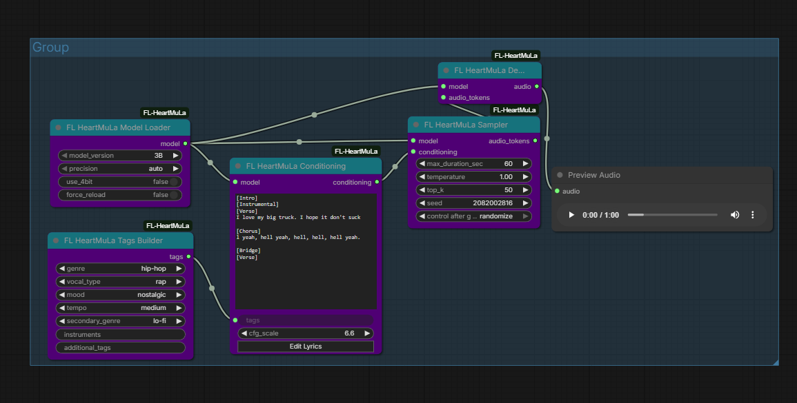

# FL HeartMuLa

Multilingual AI music generation nodes for ComfyUI powered by the HeartMuLa model family. Generate full songs with lyrics in English, Chinese, Japanese, Korean, and Spanish.

[](https://github.com/HeartMuLa/HeartLib)
[](https://www.patreon.com/Machinedelusions)



## Features

- **Multilingual Lyrics** - Generate music with vocals in English, Chinese, Japanese, Korean, and Spanish
- **Song Structure Control** - Use section markers like [Verse], [Chorus], [Bridge] to define song structure
- **Style Tags** - Control genre, vocal type, mood, tempo, and instruments
- **4-Minute Songs** - Generate up to 240 seconds of continuous audio
- **Zero-Shot Generation** - No fine-tuning required, just provide lyrics and tags
- **Modular Pipeline** - Separate nodes for conditioning, sampling, and decoding

## Nodes

| Node | Description |
|------|-------------|
| **Model Loader** | Downloads and caches HeartMuLa models |
| **Conditioning** | Tokenize lyrics and tags into model conditioning |
| **Sampler** | Generate audio tokens with CFG and temperature control |
| **Decode** | Convert audio tokens to waveform using HeartCodec |
| **Tags Builder** | Build style tags with genre, vocal, mood selection |
| **Transcribe** | Extract lyrics from existing audio |

## Installation

### ComfyUI Manager
Search for "FL HeartMuLa" and install.

### Manual
```bash
cd ComfyUI/custom_nodes
git clone https://github.com/filliptm/ComfyUI_FL-HeartMuLa.git
cd ComfyUI_FL-HeartMuLa
pip install -r requirements.txt
```

## Quick Start

1. Add **FL HeartMuLa Model Loader** and select `3B` model
2. Connect to **FL HeartMuLa Conditioning** node
3. Enter lyrics with section markers:
   ```
   [Verse]
   Walking down the empty street
   Thinking about you and me

   [Chorus]
   We belong together
   Now and forever
   ```
4. Add style tags: `pop, female vocal, energetic`
5. Connect to **Sampler** → **Decode** → **Preview Audio**

## Section Markers

HeartMuLa supports these official section markers:

| Marker | Usage |
|--------|-------|
| `[Intro]` | Opening instrumental or vocal intro |
| `[Verse]` | Main verses |
| `[Prechorus]` | Build-up before chorus |
| `[Chorus]` | Main hook/chorus |
| `[Bridge]` | Contrasting section |
| `[Outro]` | Ending section |
| `[Instrumental]` | Non-vocal sections |

## Style Tags

Combine tags to control the output style:

- **Genre**: pop, rock, electronic, jazz, classical, hip-hop, r&b, country, folk, metal, indie
- **Vocal**: female vocal, male vocal, duet, choir, instrumental
- **Mood**: energetic, melancholic, uplifting, calm, aggressive, romantic, dreamy, dark
- **Tempo**: slow, medium, fast
- **Instruments**: piano, guitar, drums, synth, strings, etc.

Example: `indie rock, male vocal, melancholic, slow, acoustic guitar`

## Models

| Model | Size | VRAM (fp16) | VRAM (4-bit) | Notes |
|-------|------|-------------|--------------|-------|
| 3B | ~6GB | ~12GB | ~6GB | Released, recommended |
| 7B | ~14GB | ~24GB | ~12GB | Coming soon |

Models download automatically on first use to `ComfyUI/models/heartmula/`.

### Memory Modes

The Model Loader includes a `memory_mode` option to optimize for different VRAM configurations:

| Mode | Description | Use Case |
|------|-------------|----------|
| `auto` | Auto-detect based on available VRAM | Recommended default |
| `normal` | Full speed, no memory optimizations | 16GB+ VRAM |
| `low` | Moderate memory savings | 10-16GB VRAM |
| `ultra` | Aggressive memory cleanup | 8-10GB VRAM |

## Requirements

- Python 3.10+
- 16GB RAM minimum (32GB+ recommended)

### Supported Platforms

| Platform | Device | Notes |
|----------|--------|-------|
| **NVIDIA GPU** | CUDA | 12GB+ VRAM (or 6GB with 4-bit quantization) |
| **Apple Silicon** | MPS | M1/M2/M3/M4 Macs supported |
| **CPU** | CPU | Slow fallback option |

### Platform Notes

- **NVIDIA**: CUDA 12.1+ recommended. 4-bit quantization available via bitsandbytes
- **Apple Silicon**: Uses Metal Performance Shaders (MPS). 4-bit quantization not available (CUDA only)
- **CPU**: Works but very slow, not recommended for generation

## Parameters

### Sampler Settings

| Parameter | Default | Range | Description |
|-----------|---------|-------|-------------|
| `max_duration_sec` | 60 | 10-240 | Maximum audio length |
| `temperature` | 1.0 | 0.1-2.0 | Sampling randomness |
| `top_k` | 50 | 1-500 | Top-k token filtering |
| `cfg_scale` | 1.5 | 1.0-10.0 | Classifier-free guidance |
| `seed` | -1 | -1 to 2^31 | Random seed (-1 = random) |

## Credits

- [HeartMuLa/HeartLib](https://github.com/HeartMuLa/HeartLib) - Original model and codebase
- [HeartMuLa/HeartCodec](https://huggingface.co/HeartMuLa/HeartCodec-oss) - Neural audio codec

## License

Apache 2.0
